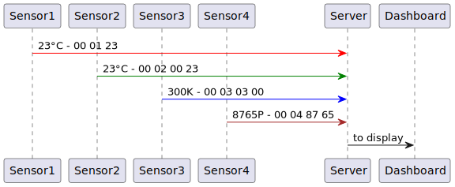

# Challenge

# Szenario
- Kommunikation mit kleine IoT-Geräten, z.B. Sensoren für Temperatur, Luftfeuchtigkeit, Luftdruck, CO2 usw.
- Die IoT-Geräte sind nur sehr klein und können keinen Webserver o.ä. hosten, um z.B. mit REST zu arbeiten. Es können sehr viele an einen Computer angeschlossen sein.
- Die Kommunikation geschieht über Bytesequenzen, die über eine physische Verbindung gesendet werden. Das kann beispielsweise der Serielle Monitor eines Arduino sein.
- Die ersten beiden Bytes geben an, welche Nachricht gesendet wird, die folgenden Bytes beinhalten die Payload.
- Jede einzige Message Type gibt an, welche Sensor die Nachricht sendet und wie das Payload aussieht. 

# Beispiele
1. Die drei Bytes "00 01 23" sind eine Nachricht vom Temperatursensor. Die ersten beiden Bytes "00 01" besagen, dass es eine Temperaturnachricht ist, die 23 ist die Temperatur in Grad Celsius.
2. Die Bytesequenz "01 03 03 00", die ersten 2 Bytes erzählen, dass es eine Temperatursensor Nachricht ist und "03 00" ist die Temperatur in Kelvin Format und muss noch in Celsius umgerechnet werden.
3. Die vier Bytes "00 02 87 65" sind eine Nachricht vom Luftdrucksensor. Die ersten beiden Bytes "00 02" besagen, dass es eine Luftdrucknachricht ist, die "87 65" ist der Luftdruck in einem internen Format und muss noch in Pascal umgerechnet werden.
4. Wie Beispiel 2, aber der Messwert wird in 4 Byte übertragen. Damit der Empfänger weiß, dass die Payload anders gelesen werden muss, wurde hier das erste Byte angepasst: "01 02 00 00 87 65" 
5. Die Bytesequenz "00 03 12 23 23 24 25 25 23 21 20 19 18 17 16" bedeutet "00 03" = Temperaturnachricht mit gesammelten Daten, 12 ist die Anzahl der Werte und 23..16 sind die einzelnen Messwerte in Grad Celsius.
6. Die Bytesequenz „10 03 03 00 23 00 23 00 24“ ist ähnlich 1c, liefert die Messwerte aber in je 2 Byte statt einem.
7. Die Bytesequenz "01 04 03 00 00 00 23 00 00 00 23 00 00 00 24" wie Beispiel 6, aber Messwerte in 4 Byte.

# Aufgaben
1. Die empfangenen Bytesequenzen sollen deserialisiert in C++ Value Objects abgelegt werden.
2. Auf umgekehrten Weg sollen Klassen in Bytesequenzen für Gerätbefehle serialisiert werden, die dann zur Steuerung an ein IoT-Geräte gesendet werden können. Beispiele: Start, Stop, Reset.
3. Die Bytesequenzen können Wiederholungen enthalten. Es kann sein, dass ein IoT-Geräte einige Zeit vom Computer getrennt war, die Daten intern gesammelt hat und nach der Verbindungsaufnahme alle auf einmal sendet.

# Variationen
- Die Bytesequenzen können if-else Konstrukte enthalten. So kann eine Nachricht mit Flags angeben, ob bestimmte Parameter in der Nachricht enthalten sind oder nicht. Beispielsweise kann ein kombinierter Temperatur, Luftfeuchtigkeit, Luftdruck und CO2 Sensor mitteilen, welche Parameter für die einzelnen physikalischen Größen in der Nachricht enthalten sind.
- Nachrichten im Big- oder Little Endian Format: bei Datentypen, die aus mehreren Bytes bestehen, z.B. short, int und long, kann erst das höherwertige und dann das niederwertige Byte gesendet werden  (Big Endian) oder andersherum erst das niederwertige und dann das höherwertige Byte (Little Endian). Der Short-Wert "87 65" kann in der Nachricht also als "87 65" oder "65 87" empfangen werden. Entsprechend sind die Bytes beim Deserialisieren zu drehen.
- eine empfangene Bytesequenz kann nur einen Teil einer Nachricht enthalten (z.B. die ersten 6 von insgesamt 10 Bytes) oder auch mehrere Nachrichten; d.h. mehrere Bytesequenzen müssen erst in einem Puffer gesammelt werden, bevor die Nachrichten deserialisiert werden können.
- Parameter können nicht nur komplette Bytes groß sein, sondern auch einfach nur 3, 11 oder 30 Bit. Die restlichen Bit bis zum nächsten Parameter müssen dann mit 0 aufgefüllt werden.
- Fehlererkennung bei der Übertragung durch einfache (oder beliebig komplexe) Fehlererkennungs- und -korrekturcodes.

# Warum dieses Szenario?
- einerseits Kunden aus dem IoT-Bereich.
- sowohl Firmware-Programmierung (in C++) als auch hostseitige Kommunikation mit IoT-Geräten (C++, Java)
- andererseits internes Weiterbildungsprojekt, welches die Klimadatenmessung als Grundlage hat
    - 4 Competence Center JVM, .NET, NodeJS und C++ arbeiten programmiersprachenübergreifend zusammen.
    - Weiterbildung wichtiger Bestandteil der Kontext-e Kultur, um "Digital Excellence" Anspruch gerecht zu werden.
    - Kultur der CC-übergreifenden Zusammenarbeit, gegenseitiges Helfen, familiäres Miteinander
    - Förderung der Mitarbeiter.    
    - Neue Mitarbeiter mit wenig oder keiner Berufserfahrung werden im Weiterbildungsprojekt auf die Herausforderungen in realen Projekten vorbereitet.

# Warum diese Aufgabe?
- keine Installation von weiterer Software wie z.B. DB notwendig (wer möchte, kann die Daten ja dennoch in einer Zeitreihendatenbank ablegen).
- kein Einarbeiten in Bibliotheken oder Frameworks, bevor es losgehen kann (wer möchte, kann dennoch beides zur Lösung der Aufgabe verwenden).
- Man müsste nicht einmal eine Applikation schreiben, alle Teilaufgaben sind Komplett in Unit Tests lösbar.
- die Aufgabe ist skalierbar: wer wenig Zeit hat, macht nur 1 oder 2. Wer mehr Zeit investieren möchte, kann auch Aufgabe 3 oder die Varianten probieren.
- Falls jemand über die Challenge hinausgehend Varianten implementiert, können diese gern beim Vorstellungsgespräch diskutiert werden.

# UML Diagramm
