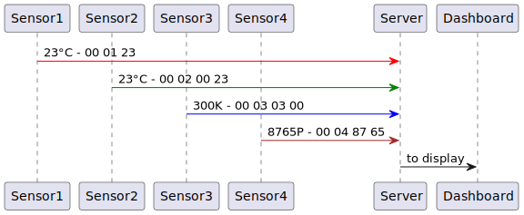

**English**
# Challenge

# Scenario
- Communication with different small IoT devices, for example Sensors for Temperature, Air-Pressure, Humidity, etc.
- The IoT devices are very small and cannot host a web-server. A large - number of IoT devices can be connected to a single Computer.
- The Communication occurs through Bytesequences, which are sent through a physical connection, for example using an Arduino.
- The first two Bytes indicate, which message is being sent, the following Bytes then contain the Payload of the message.
- Every different Message Type tells, which sensor is transmitting the message and how it's payload looks like.

# Examples
1. The three Bytes "00 01 23" represents a message from Temperature Sensor. The first two Bytes tell us that it's a message from the Temperature Sensor, and "23" is the Temperature measurement in degrees Celsius.
2. For the Bytesequence "01 03 03 00", the first two Bytes tell us that it's a message from the temperature sensor which measures the temperature in Kelvin, where "03 00" is one Temperature measurement in Kelvin, depending on the Physical Unit requirement this Temperature in Kelvin might have to be recalculated.
3. The four Bytes "00 02 87 65" represents a message from Air-pressure Sensor. The first two Bytes tell us that it's a message from the Air-pressure Sensor, and "87 65" is the Air-pressure in an internal format and could have to be recalculated.
4. For the Bytes "01 02 00 00 87 65", it is similar to example 3, but the measurement is given in 4 Bytes. The first Byte is adjusted so the receiver knows that the Payload should be read differently.
5. The Bytesequence "00 03 12 23 23 24 25 25 23 21 20 19 18 17 16" where "00 03" represents for example the temperature message, 12 is the number of values and 23 to 16 are the 12 individual values measured in degrees Celsius.
6. The Bytesequence "10 03 03 00 23 00 23 00 24" is similar to 5., but provides the measured values in 2 bytes each instead of one.
7. The Bytesequence "01 04 03 00 00 00 23 00 00 00 23 00 00 00 24" is similar as in example 6, but measured values in 4 bytes.

# Tasks
1. The receiver Bytesequences is to be deserialized and stored as C++ Value objects.
2. In the opposite way, classes have to be serialized into Bytesequences for device commands, which can then be sent to IoT device for control for example Start, Stop, Reset.
3. The Bytesequence can contain repetitions. It is possible that an IoT device is disconnected from the computer for some time and has collected the data internally and sends it all at once after connection is establised.

# Variations
- The Bytesequence can consist of if-else constructs. A Message can use Flags to indicate whether certain parameters are included in the message or not. For example, a combined temperature, humidity, air pressure and CO2 sensor can indicate which parameters for the individual physical variables are included in the message.
- Messages in Big or Little Endian format: for data types consisting of several bytes, e.g. short, int and long, the higher-value Byte can be sent first and then the lower-value Byte (Big endian) or vice versa, first the lower-value byte and then the higher-value byte (Little endian). The short value "87 65" can therefore be received in the message as "87 65" or "65 87". The bytes must be rotated accordingly during deserialization.
- A received Bytesequence can only contain part of a message (e.g. the first 6 of a total of 10 bytes) or several messages; i.e. several byte sequences must first be collected in a buffer before the messages can be deserialized.
- Parameters can not only be complete Bytes in size, but also just 3, 11 or 30 Bits. The remaining Bits up to the next parameter must then be filled with 0.
- Error detection during transmission using simple (or arbitrarily complex) error detection and correction codes.

# Why this scenario?
- Firstly, Customers from IoT sector.
- Firmware Programming (C++) and Host-side communication with IoT devices (C++, Java).
- On the other hand,internal training project based on Climate data measurement.
    - 4 Competence Centers JVM, .NET, NodeJS and C++ work together across Programming Languages.
    - Further training is an important part of the Kontext-e culture in order to live up to the "Digital Excellence" claim.
    - Culture of Cross-CC collaboration, mutual help, family-like cooperation.
    - Support for Employees.
    - New Employees with little or no professional experience are prepared for the Challenges of real Projects in the training project.

# Why this Task?
- No Installation of additional Software such as a DB necessary (if you want, you can still store the data in a time series database)
- no need to familiarize yourself with Libraries or Frameworks before you can get started (if you want, you can still use both to solve the task)
- You don't even have to write an Application, all subtasks can be solved completely in unit tests
- The task is scalable: if you don't have much time, just do 1 or 2. If you want to invest more time, you can also try task c or the variants.
- If someone implements variants beyond the Challenge, these can be discussed during the Interview.

# UML Diagram
